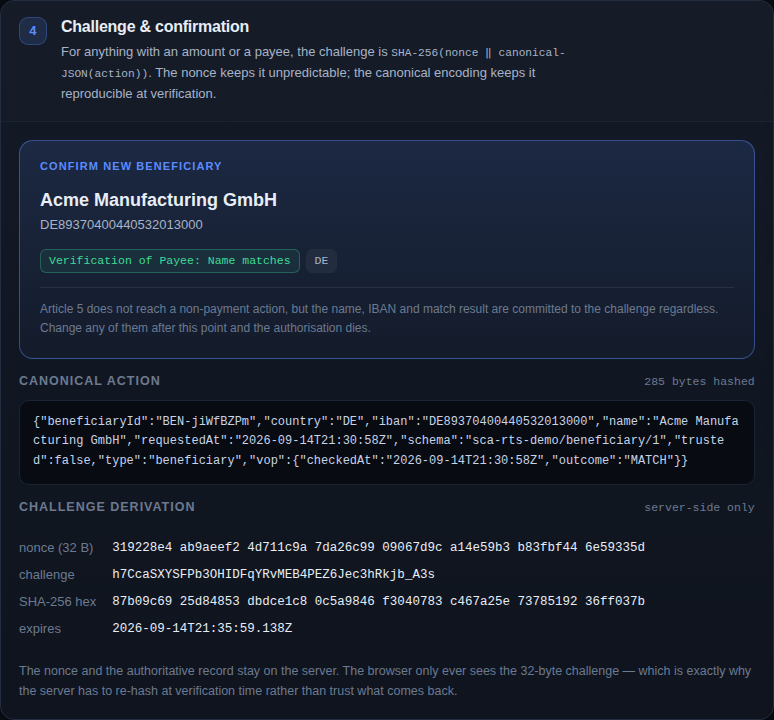
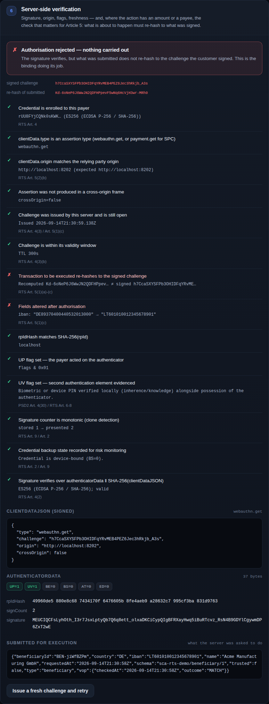

# Passkeys in a payments portal — PSD2 SCA, dynamic linking and exemptions

A working demo of what replacing SMS codes with passkeys actually involves in a first-party
payments portal, for the three things a customer authorises:

| Action | SCA required by | Exemption | Dynamic linking |
| --- | --- | --- | --- |
| **Signing in** | PSD2 Art. 97(1)(a) | RTS Art. 10 — read-only scope, not first access, within 180 days of the last SCA | Not applicable: no amount, no payee |
| **Adding a beneficiary** | PSD2 Art. 97(1)(c); RTS Art. 13(1) for the trusted list | None — the Art. 10–18 exemptions reach payment transactions and account access, not payee records | Not mandated, but worth doing: bind the name, IBAN and Verification of Payee result |
| **Initiating a credit transfer** | PSD2 Art. 97(1)(b) | RTS Art. 13–18, subject to counters and audited fraud rates | Mandatory under RTS Art. 5 whenever SCA is applied |


Along the way it shows the parts that are easy to get wrong:

- **Article 5 dynamic linking** — the authentication code is bound to the amount and the payee,
  and dies the moment either changes.
- **An attacker simulation** — rewrite the amount, the payee or the beneficiary's IBAN *after* the
  customer authorised, and watch the signature stay valid while the action is refused.
- **The exemption engines** — live Article 16 counters, Article 18 TRA bands tied to reference
  fraud rates, and the Article 10 access window that lapses.
- **Verification of Payee** — the Regulation (EU) 2024/886 match result is bound into the
  challenge, so the customer is cryptographically attesting to the warning they were shown.

Everything runs in the browser, so it deploys to GitHub Pages as static files. Because the portal
is first-party — the relying party is its own origin — no Secure Payment Confirmation is involved
and it works in every modern browser.



## Try it

**Live:** `https://owenobyrne.github.io/sca-rts-passkey-demo/` — once GitHub Pages is switched on
(see below).

**Locally** — WebAuthn needs a secure context, so use `localhost`, not a file:// URL or an IP:

```bash
git clone https://github.com/owenobyrne/sca-rts-passkey-demo.git
cd sca-rts-passkey-demo
python3 -m http.server 8000
open http://localhost:8000
```

A suggested run-through:

1. **Create passkey** — note the flags the server records: `UV`, and `BE`/`BS` if your passkey is
   synced across devices.
2. **Sign in.** The first access always needs SCA. Afterwards, switch the scope to read-only and
   assess again: Article 10 now exempts it. Switch back to full portal access and it does not —
   a session that can move money is never covered. Then press *Simulate 200 days passing* and
   watch the window lapse.
3. **Add a beneficiary.** No exemption exists for this, whatever the amount. Set the Verification
   of Payee result to *No match* to see the warning bound into the challenge, then use the
   attacker control to **swap the IBAN after authorisation**. The signature still verifies; the
   beneficiary is refused. That is the attack that matters most in B2B payments, because a payee
   record converts into every future payment.
4. **Make a payment** to the beneficiary you just added. Because it was added to the trusted list
   — which itself required SCA — Article 13 now exempts the payment. Tick *Apply SCA even if an
   exemption is available* to override it.
5. Pay a new payee €150 instead and authorise properly, then repeat with **Change the amount
   (×100)**. Signature valid, payment refused: Article 5(1)(d) doing its job.
6. **Replay the last authorisation** — rejected, because an authentication code may not be
   reusable (Art. 4(3)(a)).
7. Try the **€12 low-value payment** repeatedly and watch the Article 16 counters fill up until
   SCA comes back.



## Enabling GitHub Pages

Pages has to be switched on once by hand — the workflow's `GITHUB_TOKEN` cannot create a Pages
site, since that needs repository admin rights:

1. **Settings → Pages → Build and deployment → Source: GitHub Actions**.
2. Re-run the latest **Deploy demo to GitHub Pages** workflow from the Actions tab (or push
   anything). Until step 1 is done it fails at `configure-pages` with *"Get Pages site failed"*.

Alternatively, pick **Deploy from a branch** with the branch holding this code and folder `/`
(root), and skip the workflow entirely — it is all static files.

The site is plain static files, so **Deploy from a branch** works just as well if you prefer it —
the `.nojekyll` file is there so Jekyll does not eat anything.

### A note on the relying-party ID

Hosted on GitHub Pages the RP ID is your `*.github.io` subdomain, which works because `github.io`
is on the Public Suffix List — credentials are scoped to `owenobyrne.github.io` and not shared
with other users' pages. A real PSP scopes passkeys to its own registrable domain, and should
pick it carefully: **the RP ID cannot be changed later without re-enrolling every payer**.

## How the dynamic linking works

**The challenge is a commitment to the transaction.** The server generates a random nonce, hashes
it together with a canonical encoding of the transaction, and keeps the nonce and the transaction:

```js
const nonce = randomBytes(32);
const canonical = canonicalJson(transaction);          // sorted keys, no whitespace
const challenge = await sha256(concat(nonce, utf8(canonical)));
```

The canonical encoding matters: both hashes have to be taken over the same bytes, so key order
must be part of the protocol rather than an accident of insertion order. The nonce matters
because a transaction is guessable — without it, anyone who knows the amount and payee could
precompute the challenge.

**The client signs it.** `userVerification: "required"`, because SCA needs two elements:

```js
const assertion = await navigator.credentials.get({
  publicKey: { challenge, allowCredentials, rpId, userVerification: 'required' },
});
```

**The server re-hashes what it is about to do.** This is the step that is usually missing:

```js
const recomputed = await sha256(concat(storedNonce, utf8(canonicalJson(executionPayload))));
if (recomputed !== clientData.challenge) reject();      // Art. 5(1)(d)
```

A hash is one-way, so the challenge coming back tells the server nothing on its own. Only by
re-hashing *the record it is about to act on* — with the nonce and record it kept — can it prove
the action is the one the customer saw. Skip this and an attacker edits the amount, or the IBAN,
after authorisation while the signature still verifies perfectly.

The technique is not payment-specific: the beneficiary flow commits the name, IBAN and match
result the same way. Signing in commits nothing, because there is nothing to commit — its
challenge is 32 random bytes, and the session's scope is decided by the server from its own
records rather than from anything the client submits.

## What this does not protect against

The passkey prompt shows the *site*, not the transaction. WebAuthn's trusted UI answers *who are
you authenticating to*, never *what are you approving* — the amount and payee come from the page,
which is exactly the component you might not trust.

Dynamic linking therefore defeats tampering that happens **after** the action reaches the server's
authoritative record: a modified request body, a tampered API hop, a replayed assertion, a mix-up
between what was authorised and what gets executed. It does **not** defeat a compromised page:
hostile script initiates €15,000, the server mints a challenge committing to €15,000, the page
displays €150, the customer approves a prompt that mentions neither, and every check goes green.
The binding ties the code to what the *server* was told, not to what the *human* saw.

Secure Payment Confirmation narrows the gap by moving the display into the browser. A second
device with its own display closes it. And note that an SMS containing the amount and payee is an
independent display channel that passkeys give up — an argument for passkeys plus a second-channel
confirmation above a value threshold, not for keeping SMS.

## The passkey on a phone, the portal on a desktop

Supported, and a first-class flow: **hybrid transport** (cross-device authentication). QR code on
the desktop, camera on the phone, Bluetooth proximity, assertion back through an encrypted tunnel.
The proximity step is what stops an attacker relaying a QR code to a distant victim.

**But a passkey on a phone is not a second channel.** The phone's prompt names the site, not the
amount or payee — hybrid changes where the key lives, not what the customer can verify. It does
not close the gap above; that still needs an app that renders the transaction on the phone.

Expect friction: unless the devices are linked or the passkey already syncs to the desktop, it is
QR plus camera plus Bluetooth on every authentication. Enrolling a passkey on the desktop too, and
keeping the phone for bootstrapping and recovery, is usually the better shape. Check two blockers
first: corporate builds that disable Bluetooth or the camera cannot do hybrid at all, and virtual
desktop environments often cannot reach a local authenticator without WebAuthn redirection.

## Your fallback is your real security level

A phishing-resistant passkey with an SMS reset path is a phishable system: the attacker simply
forces the downgrade. This is the most common way a passkey rollout fails to deliver the security
it promised, and no amount of WebAuthn correctness fixes it.

The workable pattern is an *unequal* fallback rather than an equivalent one — a session
authenticated by the fallback can view and prepare, but cannot add a beneficiary or release a
payment above a threshold without a passkey or an operator-verified re-enrolment. Enrol two
authenticators at onboarding so losing one is routine rather than an incident. And weight the
step-up by what the action converts into: beneficiary creation deserves the strongest you have.

## Three corrections to the commonly circulated approach

1. **`userVerification: "discouraged"` defeats SCA.** PSD2 Art. 4(30) requires two independent
   elements. A passkey assertion with only `UP` set evidences *possession* alone. The second
   element — inherence (biometric) or knowledge (device PIN) — is evidenced by the `UV` flag, and
   you get it by requesting `userVerification: "required"` **and verifying the flag server-side**.
   Requesting it is not evidence; the flag in `authenticatorData` is.

2. **There is no `extensions.payment` dictionary on `navigator.credentials.get()`.** The real
   mechanism is Secure Payment Confirmation: a `PaymentRequest` using the
   `secure-payment-confirmation` method, whose `response.details` is a `PublicKeyCredential`. The
   browser renders the amount and payee and writes them into `clientDataJSON` as
   `clientData.payment`, where the server verifies them. Credentials opt in at registration with
   `extensions: { payment: { isPayment: true } }` — and that extension must only be sent where the
   browser exposes `PaymentRequest`, because the SPC specification has `create()` throw
   `NotSupportedError` on a user agent without SPC. Ask for it unconditionally and you do not
   merely lose SPC, you lose enrolment.

   SPC's headline purpose is cross-origin — a merchant invoking a bank's credential — which a
   first-party portal does not need. Its *second* property is the one that matters here: the
   browser renders the amount and payee and signs those same values, so a compromised page cannot
   display one figure and sign another. The demo offers it as a step-up on the payment flow where
   available, falling back to plain WebAuthn with a page-rendered panel. Chromium-only, so it is
   an enhancement and never the control. The challenge binding is identical either way.

3. **Hashing the transaction is only half of dynamic linking** — see the re-hash step above.

## Compliance mapping

| Verification step | Provision | Why |
| --- | --- | --- |
| Action re-hashes to the signed challenge | Art. 5(1)(b)–(d) | The code is specific to this amount and payee, and invalid if either changes |
| Challenge is single-use and time-boxed (5 min) | Art. 4(3) | Authentication codes are not reusable and expire |
| `UV` flag asserted and checked | PSD2 Art. 4(30); RTS Art. 6–8 | Second, independent element beside possession |
| Signature over `authData ‖ SHA-256(clientDataJSON)` | Art. 4(2) | Only the enrolled authenticator could have produced the code |
| `origin` and `rpIdHash` checks | Art. 5(2); Art. 22 | Phishing resistance — a passkey will not sign for the wrong origin |
| Signature counter and backup state recorded | Art. 2, Art. 9 | Transaction-monitoring signals; synced keys change the possession analysis |
| Amount and payee displayed before the prompt | Art. 5(1)(a) | The payer must be aware of what they are authorising |
| Exemption engines | Art. 10–18 | When SCA may be skipped, and the counters and windows that end that |
| Beneficiary name, IBAN and match result bound and displayed | Reg. (EU) 2024/886; PSD2 Art. 97(1)(c) | The customer attests to the Verification of Payee result they were shown |

The Article 16 counters (≤ €30 per payment, ≤ €100 cumulative **or** ≤ 5 consecutive payments
since the last SCA) and the Article 18 TRA bands (€100 / €250 / €500 against audited fraud rates
of 0.13 % / 0.06 % / 0.01 %) are both live in the demo.

## Layout

```
index.html                    the demo UI
assets/js/app.js              UI orchestration; the SCENARIOS table holds the per-action differences
assets/js/bank-server.js      simulated PSP: challenge minting, assertion verification, portal state
assets/js/sca-engine.js       decision engines for access, beneficiary and payment
assets/js/client.js           navigator.credentials.* and Secure Payment Confirmation
assets/js/webauthn-codec.js   authenticatorData, COSE keys, DER→raw ECDSA signatures
assets/js/cbor.js             minimal CBOR decoder for the attestation object
assets/js/util.js             base64url, SHA-256, canonical JSON
tests/e2e.mjs                 end-to-end test driven by a virtual authenticator
```

Verification uses nothing but the Web Crypto API: the attestation object is CBOR-decoded, the
public key is imported as a JWK, and ES256 signatures are unwrapped from DER into raw `r‖s`
before `crypto.subtle.verify`. There is no library to audit.

## Tests

The full flow — registration, assertion, signature verification, dynamic linking, replay
rejection, tampering across all three flows, the Article 10 window, the Article 16 counters, and
enrolment on a browser with no `PaymentRequest` — is exercised against Chromium's virtual
authenticator, so it runs in CI without hardware (44 checks):

```bash
npm install --no-save playwright
npx playwright install chromium
node tests/e2e.mjs
```

## What this is not

**The "portal server" runs in your tab.** Every decision it makes is therefore worthless as a
security control — the payer can reach all of it. In a real deployment, the challenge state, the
credential registry, the beneficiary records, the ledger and every check in step 6 live on a server. The code is
structured to make that split obvious (`bank-server.js` never touches the DOM), but it is a
teaching model, not a starting point you can deploy.

Also absent, and all mandatory in production: Article 2 transaction monitoring, Article 3
auditing, Article 19 fraud-rate calculation and reporting (the TRA exemption is *earned* by an
audited fraud rate, not selected from a dropdown), a real Verification of Payee call to the payee's
PSP, multi-user corporate accounts with four-eyes approval, and the passkey lifecycle and
account-recovery flows that are usually where the real risk sits.

No data leaves your browser: state is held in `localStorage` and cleared by **Reset demo**. Your
passkey stays on your device; remove it in your password manager or platform settings if you want
it gone.

This is a teaching demo, not legal advice and not a product. Where it matters, read
[Regulation (EU) 2018/389](https://eur-lex.europa.eu/eli/reg_del/2018/389/oj) and the EBA's
opinions on SCA rather than this README.

## Licence

MIT — see [LICENSE](LICENSE).
