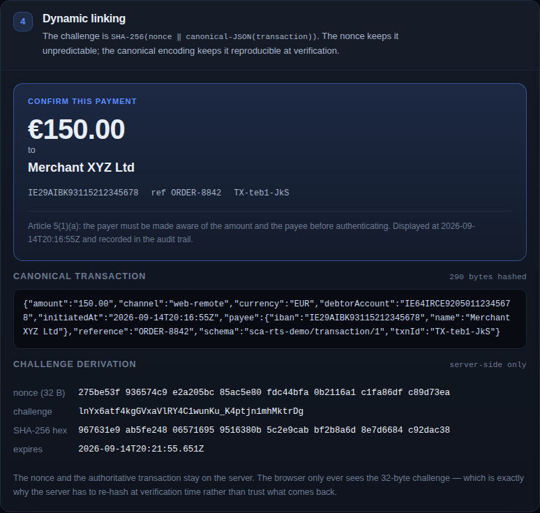
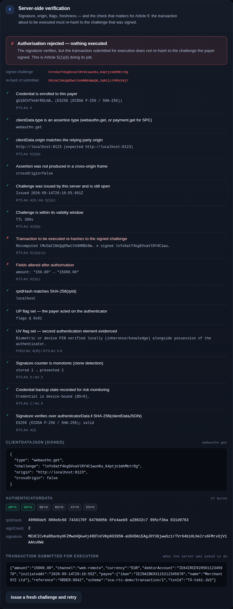

# Passkeys for PSD2 payments — dynamic linking & SCA exemptions

A working, static demo of what it actually takes to authorise a payment with a passkey under
PSD2 and Commission Delegated Regulation (EU) 2018/389 (the RTS on strong customer
authentication):

- **Article 5 dynamic linking** — the authentication code is bound to the amount and the payee,
  and dies the moment either changes.
- **Articles 10–18 exemptions** — an engine that evaluates every candidate exemption, including
  the running counters that bring SCA back.
- **Secure Payment Confirmation** — where the browser supports it, the amount and payee are
  rendered by the browser and signed into `clientDataJSON`, so the visual confirmation becomes
  cryptographic evidence rather than a promise the page makes.
- **An attacker simulation** — rewrite the amount or the payee *after* the payer authorised, and
  watch the signature stay valid while the payment is refused.

Everything runs in the browser, so it deploys to GitHub Pages as static files.



## Try it

**Live:** `https://owenobyrne.github.io/sca-rts-passkey-demo/` — once GitHub Pages is switched on
(see below).

**Locally** — WebAuthn needs a secure context, so use `localhost`, not a file:// URL or an IP:

```bash
git clone https://github.com/owenobyrne/sca-rts-passkey-demo.git
cd sca-rts-passkey-demo
python3 -m http.server 8000
open http://localhost:8000
```

A suggested run-through:

1. **Create passkey** — note the flags the server records: `UV`, and `BE`/`BS` if your passkey is
   synced across devices.
2. Leave the €150 payment as it is and **Assess SCA requirement**. At the default 0.13 % fraud
   band the transaction risk analysis ceiling is €100, so SCA is required.
3. **Generate dynamically linked challenge** — the canonical transaction, the nonce and the
   resulting SHA-256 are all shown.
4. Authorise with the passkey. Every server-side check is reported with the provision it serves.
5. Now do it again with **Change the amount (×100)** selected. The signature still verifies; the
   payment is refused. That gap is the entire point of Article 5.
6. **Replay the last authorisation** — rejected, because an authentication code may not be
   reusable (Art. 4(3)(a)).
7. Try the **€12 low-value payment** repeatedly and watch the Article 16 counters fill up until
   SCA comes back.



## Enabling GitHub Pages

Pages has to be switched on once by hand — the workflow's `GITHUB_TOKEN` cannot create a Pages
site, since that needs repository admin rights:

1. **Settings → Pages → Build and deployment → Source: GitHub Actions**.
2. Re-run the latest **Deploy demo to GitHub Pages** workflow from the Actions tab (or push
   anything). Until step 1 is done it fails at `configure-pages` with *"Get Pages site failed"*.

Alternatively, pick **Deploy from a branch** with the branch holding this code and folder `/`
(root), and skip the workflow entirely — it is all static files.

The site is plain static files, so **Deploy from a branch** works just as well if you prefer it —
the `.nojekyll` file is there so Jekyll does not eat anything.

### A note on the relying-party ID

Hosted on GitHub Pages the RP ID is your `*.github.io` subdomain, which works because `github.io`
is on the Public Suffix List — credentials are scoped to `owenobyrne.github.io` and not shared
with other users' pages. A real PSP scopes passkeys to its own registrable domain, and should
pick it carefully: **the RP ID cannot be changed later without re-enrolling every payer**.

## How the dynamic linking works

**The challenge is a commitment to the transaction.** The server generates a random nonce, hashes
it together with a canonical encoding of the transaction, and keeps the nonce and the transaction:

```js
const nonce = randomBytes(32);
const canonical = canonicalJson(transaction);          // sorted keys, no whitespace
const challenge = await sha256(concat(nonce, utf8(canonical)));
```

The canonical encoding matters: both hashes have to be taken over the same bytes, so key order
must be part of the protocol rather than an accident of insertion order. The nonce matters
because a transaction is guessable — without it, anyone who knows the amount and payee could
precompute the challenge.

**The client signs it.** `userVerification: "required"`, because SCA needs two elements:

```js
const assertion = await navigator.credentials.get({
  publicKey: { challenge, allowCredentials, rpId, userVerification: 'required' },
});
```

**The server re-hashes what it is about to execute.** This is the step that is usually missing:

```js
const recomputed = await sha256(concat(storedNonce, utf8(canonicalJson(executionPayload))));
if (recomputed !== clientData.challenge) reject();      // Art. 5(1)(d)
```

A hash is one-way, so the challenge coming back tells the server nothing on its own. Only by
re-hashing *the transaction it is about to execute* — with the nonce and transaction it kept —
can it prove the payment is the one the payer saw. Skip this and an attacker edits the amount
after authorisation while the signature still verifies perfectly.

## Three corrections to the commonly circulated approach

1. **`userVerification: "discouraged"` defeats SCA.** PSD2 Art. 4(30) requires two independent
   elements. A passkey assertion with only `UP` set evidences *possession* alone. The second
   element — inherence (biometric) or knowledge (device PIN) — is evidenced by the `UV` flag, and
   you get it by requesting `userVerification: "required"` **and verifying the flag server-side**.
   Requesting it is not evidence; the flag in `authenticatorData` is.

2. **There is no `extensions.payment` dictionary on `navigator.credentials.get()`.** The real
   mechanism is Secure Payment Confirmation: a `PaymentRequest` using the
   `secure-payment-confirmation` method, whose `response.details` is a `PublicKeyCredential`. The
   browser renders the amount and payee and writes them into `clientDataJSON` as
   `clientData.payment`, where the server verifies them. Credentials opt in at registration with
   `extensions: { payment: { isPayment: true } }`. SPC is Chromium-only today, so treat it as an
   enhancement: this demo tries it first and falls back to plain WebAuthn with a page-rendered
   confirmation panel. The challenge binding is identical either way.

3. **Hashing the transaction is only half of dynamic linking** — see the re-hash step above.

## Compliance mapping

| Verification step | Provision | Why |
| --- | --- | --- |
| Executed transaction re-hashes to the signed challenge | Art. 5(1)(b)–(d) | The code is specific to this amount and payee, and invalid if either changes |
| Challenge is single-use and time-boxed (5 min) | Art. 4(3) | Authentication codes are not reusable and expire |
| `UV` flag asserted and checked | PSD2 Art. 4(30); RTS Art. 6–8 | Second, independent element beside possession |
| Signature over `authData ‖ SHA-256(clientDataJSON)` | Art. 4(2) | Only the enrolled authenticator could have produced the code |
| `origin` and `rpIdHash` checks | Art. 5(2); Art. 22 | Phishing resistance — a passkey will not sign for the wrong origin |
| Signature counter and backup state recorded | Art. 2, Art. 9 | Transaction-monitoring signals; synced keys change the possession analysis |
| Amount and payee displayed before the prompt | Art. 5(1)(a) | The payer must be aware of what they are authorising |
| Exemption engine | Art. 10–18 | When SCA may be skipped, and the counters that end that |

The Article 16 counters (≤ €30 per payment, ≤ €100 cumulative **or** ≤ 5 consecutive payments
since the last SCA) and the Article 18 TRA bands (€100 / €250 / €500 against audited fraud rates
of 0.13 % / 0.06 % / 0.01 %) are both live in the demo.

## Layout

```
index.html                    the demo UI
assets/js/app.js              UI orchestration and rendering
assets/js/bank-server.js      simulated PSP: challenge minting and assertion verification
assets/js/sca-engine.js       Articles 10–18 exemption engine
assets/js/client.js           navigator.credentials.* and Secure Payment Confirmation
assets/js/webauthn-codec.js   authenticatorData, COSE keys, DER→raw ECDSA signatures
assets/js/cbor.js             minimal CBOR decoder for the attestation object
assets/js/util.js             base64url, SHA-256, canonical JSON
tests/e2e.mjs                 end-to-end test driven by a virtual authenticator
```

Verification uses nothing but the Web Crypto API: the attestation object is CBOR-decoded, the
public key is imported as a JWK, and ES256 signatures are unwrapped from DER into raw `r‖s`
before `crypto.subtle.verify`. There is no library to audit.

## Tests

The full flow — registration, assertion, signature verification, dynamic linking, replay
rejection, tampering, exemption counters — is exercised against Chromium's virtual authenticator,
so it runs in CI without hardware:

```bash
npm install --no-save playwright
npx playwright install chromium
node tests/e2e.mjs
```

## What this is not

**The "bank server" runs in your tab.** Every decision it makes is therefore worthless as a
security control — the payer can reach all of it. In a real deployment, the challenge state, the
credential registry, the ledger and every check in step 6 live on a server. The code is
structured to make that split obvious (`bank-server.js` never touches the DOM), but it is a
teaching model, not a starting point you can deploy.

Also absent, and all mandatory in production: Article 2 transaction monitoring, Article 3
auditing, Article 19 fraud-rate calculation and reporting (the TRA exemption is *earned* by an
audited fraud rate, not selected from a dropdown), passkey lifecycle and account-recovery flows —
usually where the real risk sits — and fallback authentication for payers without a usable
authenticator.

No data leaves your browser: state is held in `localStorage` and cleared by **Reset demo**. Your
passkey stays on your device; remove it in your password manager or platform settings if you want
it gone.

This is a teaching demo, not legal advice and not a product. Where it matters, read
[Regulation (EU) 2018/389](https://eur-lex.europa.eu/eli/reg_del/2018/389/oj) and the EBA's
opinions on SCA rather than this README.

## Licence

MIT — see [LICENSE](LICENSE).
